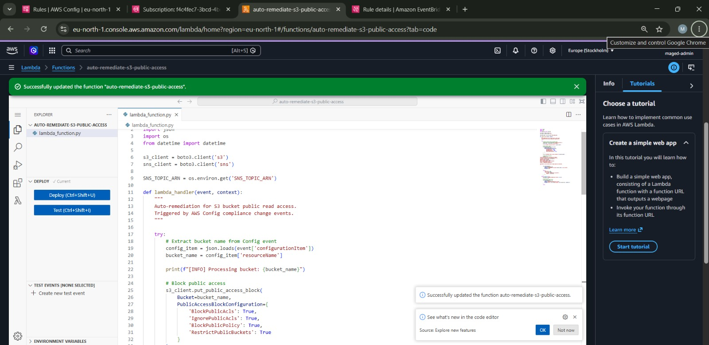
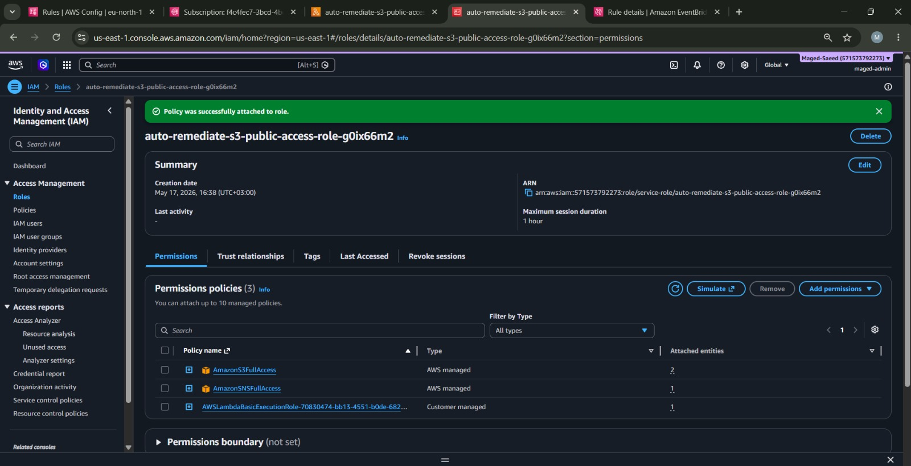
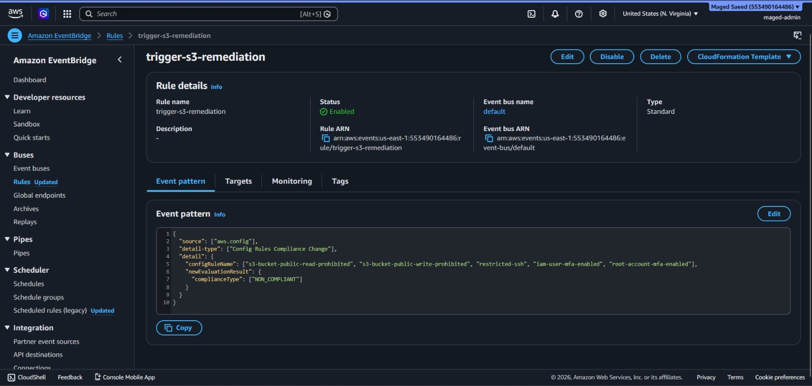
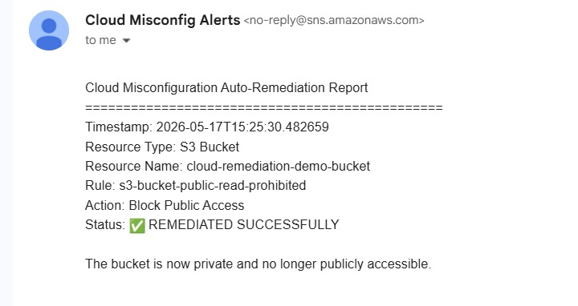

# AWS Cloud Misconfiguration Auto-Remediation

Cloud security automation project for detecting and automatically remediating AWS cloud misconfigurations using AWS native services.

---

# 📌 Project Overview

This project was built to automatically detect insecure AWS cloud configurations and remediate them in real time using a serverless event-driven architecture.

The current implementation focuses on detecting publicly accessible Amazon S3 buckets and automatically blocking public access.

---

# 🚀 Features

- Detects public S3 bucket access
- Automatically remediates insecure configurations
- Sends SNS email alerts
- Uses AWS Config compliance monitoring
- Event-driven automation with EventBridge
- CloudWatch logging integration
- Serverless architecture

---

# 🏗️ AWS Services Used

- AWS Lambda
- AWS Config
- Amazon EventBridge
- Amazon SNS
- Amazon S3
- CloudWatch Logs
- IAM

---

# ⚙️ Architecture

```text
AWS Config
    ↓
EventBridge Rule
    ↓
Lambda Function
    ↓
S3 Auto-Remediation
    ↓
SNS Email Alert
    ↓
CloudWatch Logs
```

---

# 🔥 Current Implemented Rule

## S3 Public Read Detection

AWS Config monitors S3 buckets using:

```text
s3-bucket-public-read-prohibited
```

When a bucket becomes public:

1. AWS Config detects the violation
2. EventBridge triggers Lambda
3. Lambda blocks public access automatically
4. SNS sends alert email
5. CloudWatch stores logs

---

# 🧠 Lambda Function Logic

The Lambda function performs:

- Extract bucket name from AWS Config event
- Apply S3 Public Access Block
- Send SNS notification
- Log remediation event

---

# 📸 Screenshots

## Lambda Function



---

## IAM Permissions



---

## EventBridge Rule



---

## SNS Alert Email



---

# ✅ Testing Result

The system successfully detected and remediated a public S3 bucket automatically.

### Test Workflow

1. Public bucket policy applied
2. AWS Config detected violation
3. EventBridge triggered Lambda
4. Public access blocked automatically
5. SNS email alert received

Result:

```text
REMEDIATED SUCCESSFULLY
```

---

# 📂 Repository Structure

```text
aws-cloud-misconfiguration-auto-remediation/
│
├── README.md
├── progress-log.md
├── screenshots/
├── lambda/
└── docs/
```

---

# 📈 Future Improvements

Planned features:

- S3 public write remediation
- SSH open-to-world remediation
- RDP exposure remediation
- IAM policy remediation
- Root MFA detection
- DynamoDB logging
- Real-time dashboard
- Automated evaluation scripts
