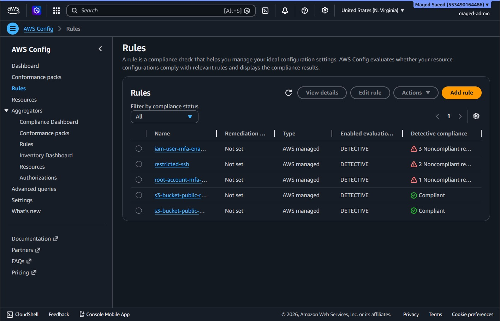
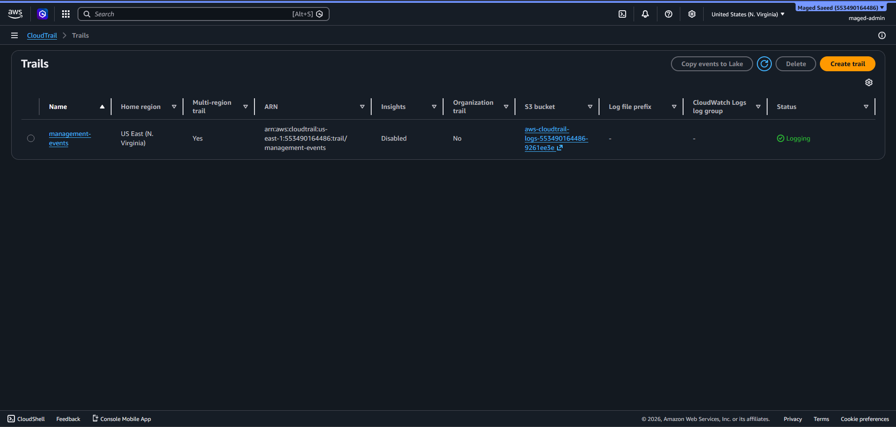
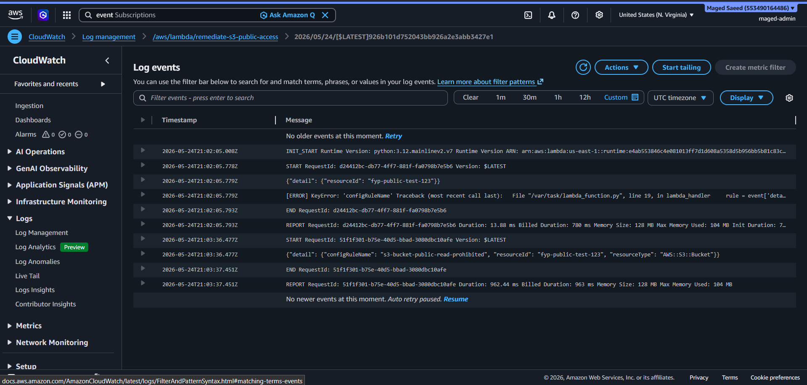

<div align="center">

<h1>☁️ AWS Cloud Misconfiguration Auto-Remediation</h1>

<p><b>Serverless, event-driven security automation on AWS.</b><br/>
Detects cloud misconfigurations in real time, automatically remediates public S3 exposure and high-risk open ports,<br/>alerts administrators, and maintains a complete audit trail — built and tested in a live AWS environment.</p>

<br/>

[](https://aws.amazon.com/)
[](https://www.python.org/)
[](https://aws.amazon.com/lambda/)
[](LICENSE)

<sub>

[Overview](#-overview) • [Controls](#-implemented-controls) • [Architecture](#-architecture) • [How It Works](#-how-it-works) • [Screenshots](#-screenshots) • [Results](#-results) • [Deployment](#-deployment) • [Roadmap](#-future-work)

</sub>

</div>

<br/>

<div align="center">

<table>
<tr>
<td align="center"><b>🎓 Project</b><br/><sub>Final Year Project</sub></td>
<td align="center"><b>🌍 Region</b><br/><sub>us-east-1</sub></td>
<td align="center"><b>🐍 Runtime</b><br/><sub>Python 3.12</sub></td>
<td align="center"><b>⚡ Model</b><br/><sub>Event-driven</sub></td>
<td align="center"><b>✅ Status</b><br/><sub>Working &amp; tested</sub></td>
</tr>
</table>

</div>

---

## Overview

Cloud misconfigurations — such as a publicly readable S3 bucket or a high-risk port left open to the internet — are among the most common causes of security incidents, and fixing them manually is slow and does not scale.

This project implements a serverless, event-driven remediation pipeline on AWS. **AWS CloudTrail** records every API call, and **Amazon EventBridge** reacts to security-group changes *within seconds*, invoking an **AWS Lambda** function that scans for high-risk port exposure and closes it automatically. (**AWS Config** managed rules also cover S3 public access and MFA checks.)

Every remediation is recorded in **DynamoDB**, written to an **S3** CSV audit log, and announced by email through **Amazon SNS**, with full execution logging in **Amazon CloudWatch**.

The entire system was deployed and tested in a live AWS account in the `us-east-1` region.

<div align="center">

| 🔍 Detect | 🛠️ Remediate | 📣 Alert | 🧾 Audit |
|:---:|:---:|:---:|:---:|
| Config rules + CloudTrail | Lambda functions | SNS email | DynamoDB + S3 + CloudWatch |

</div>

---

## 🚨 Problem Statement

A single exposed resource can compromise an entire cloud environment, and the real risk lives in the gap between a misconfiguration appearing and it being detected and fixed. Manual monitoring is slow, easy to miss across many resources, and reactive — problems are often found *after* an incident rather than before one. This project closes that gap automatically for the controls it covers, responding within **seconds** of a violation through its real-time CloudTrail path.

---

## ✅ Implemented Controls

<div align="center">

| Control | Detection Source | Action |
|:---|:---|:---:|
| **High-Risk Port Exposure** (SSH, Telnet, RDP, VNC, SQL Server, MySQL, PostgreSQL) | CloudTrail + Config custom rule | 🛠️ &nbsp;Detect + Auto-Remediate |
| **S3 Public Read** | `s3-bucket-public-read-prohibited` | 🛠️ &nbsp;Detect + Auto-Remediate |
| **S3 Public Write** | `s3-bucket-public-write-prohibited` | 🛠️ &nbsp;Detect + Auto-Remediate |
| **SSH Exposure (EC2)** | `restricted-ssh` | 🛠️ &nbsp;Detect + Remediate |
| **RDS Public Access** | `rds-instance-public-access-check` | 🛠️ &nbsp;Detect + Remediate |
| **IAM User MFA** | `iam-user-mfa-enabled` | 🔔 &nbsp;Detect + Alert |
| **Root Account MFA** | `root-account-mfa-enabled` | 🔔 &nbsp;Detect + Alert |

</div>

**High-risk ports monitored by the custom rule**

<div align="center">

| Port | Service | Port | Service |
|:---:|:---|:---:|:---|
| **22** | SSH | **3306** | MySQL |
| **23** | Telnet | **5432** | PostgreSQL |
| **1433** | SQL Server | **5900** | VNC |
| **3389** | RDP | | |

</div>

**Supporting capabilities**

- 📣 &nbsp;Email alerting through Amazon SNS
- 🧾 &nbsp;Audit logging in Amazon DynamoDB **and** a versioned CSV trail in Amazon S3
- 📊 &nbsp;Execution monitoring in Amazon CloudWatch
- 🏷️ &nbsp;Whitelisting via resource tag (`Approved = true`) so approved exceptions are skipped

> MFA findings are **alert-only** because enabling MFA requires manual user enrollment (registering a device) and cannot be remediated programmatically. The system records the finding and notifies the administrator instead of acting on it.

---

## 🏗️ Architecture

The system is event-driven and fully serverless — no servers to manage, and every component scales and bills on demand.

```text
   Security-group change (port opened to the internet)
                  │
                  ▼
        CloudTrail  (records the API call)
                  │
                  ▼
        EventBridge  (matches AuthorizeSecurityGroupIngress)
                  │
                  ▼
        Lambda: FYP1-Custom-Rule  (scans for high-risk ports)
                  │
                  ▼
   Remediate  →  SNS email  →  DynamoDB  →  S3 audit CSV  →  CloudWatch logs
```

> AWS Config managed rules also feed S3 public-access and MFA findings into the same remediation/alerting layer.
>
> The architecture diagram image (`architecture-diagram.svg`) should be regenerated to match this flow.

---

## 🧰 AWS Services Used

<div align="center">


</div>

| Service | Role in the Project |
|:---|:---|
| **AWS Config** | Continuously evaluates resources against managed rules, and hosts the custom `honeypot-port-detection` rule |
| **AWS CloudTrail** | Records security-group API calls so EventBridge can react in real time |
| **Amazon EventBridge** | Routes both Config compliance events and CloudTrail security-group events to Lambda |
| **AWS Lambda** | Two functions execute the remediation logic and trigger alerting, auditing, and logging |
| **Amazon S3** | Monitored/auto-remediated resource **and** destination for the CSV audit log |
| **Amazon EC2** | Security groups monitored for high-risk port exposure |
| **Amazon SNS** | Sends email alerts via the `cloud-misconfig-alerts` topic |
| **Amazon DynamoDB** | Stores the structured audit trail of every remediation |
| **Amazon CloudWatch** | Captures Lambda execution logs |
| **AWS IAM** | Provides the Lambda execution roles and permissions |

---

## ⚙️ How It Works

```text
 1.  An inbound rule opens a high-risk port to 0.0.0.0/0 (or ::/0)
 2.  CloudTrail records the AuthorizeSecurityGroupIngress API call
 3.  EventBridge matches the call and invokes FYP1-Custom-Rule within seconds
 4.  Lambda fetches the security group, skips it if tagged Approved=true,
     and scans all ingress rules against the 7 high-risk ports
 5.  If AUTO_REMEDIATE=true, Lambda revokes each offending rule
 6.  Lambda writes a DynamoDB record, appends to the S3 CSV audit log,
     and sends an SNS email alert
 7.  CloudWatch records the full execution log
```

> AWS Config managed rules (S3 public access, MFA) are handled the same way through the `remediate-s3-public-access` Lambda.

<details>
<summary><b>EventBridge event pattern (as deployed)</b></summary>

<br/>

```json
{
  "source": ["aws.ec2"],
  "detail-type": ["AWS API Call via CloudTrail"],
  "detail": {
    "eventSource": ["ec2.amazonaws.com"],
    "eventName": ["AuthorizeSecurityGroupIngress", "CreateSecurityGroup"]
  }
}
```

</details>

> **Important:** detection depends on **CloudTrail being enabled**. EventBridge cannot see security-group API calls unless a CloudTrail trail is actively logging — this was the key requirement for the system to function.

---

## 🔧 Configuration & IAM

**`FYP1-Custom-Rule` environment variables**

| Key | Value |
|:---|:---|
| `AUTO_REMEDIATE` | `true` |
| `SNS_TOPIC_ARN` | `arn:aws:sns:us-east-1:************:cloud-misconfig-alerts` |
| `DYNAMODB_TABLE` | `fyp-security-alerts` |
| `AUDIT_BUCKET` | `fyp-audit-logs-************` |

**`FYP1-Custom-Rule` execution role — least-privilege inline policy**

```json
{
  "Version": "2012-10-17",
  "Statement": [
    { "Effect": "Allow",
      "Action": ["ec2:DescribeSecurityGroups", "ec2:RevokeSecurityGroupIngress"],
      "Resource": "*" },
    { "Effect": "Allow",
      "Action": "sns:Publish",
      "Resource": "arn:aws:sns:us-east-1:************:cloud-misconfig-alerts" },
    { "Effect": "Allow",
      "Action": ["s3:GetObject", "s3:PutObject"],
      "Resource": "arn:aws:s3:::fyp-audit-logs-************/*" },
    { "Effect": "Allow",
      "Action": "dynamodb:PutItem",
      "Resource": "arn:aws:dynamodb:us-east-1:************:table/fyp-security-alerts" },
    { "Effect": "Allow",
      "Action": "config:PutEvaluations",
      "Resource": "*" }
  ]
}
```

> The high-risk port Lambda already runs on a tightly scoped, least-privilege policy. Applying the same scoping to the `remediate-s3-public-access` role (which currently uses broad AWS managed policies) is part of planned future work.

---

## 📸 Screenshots

<div align="center">

<table>
<tr>
<td width="50%" align="center">
<br/>
<sub><b>AWS Config Rules</b><br/>Managed + custom rules and compliance status</sub>
</td>
<td width="50%" align="center">
<br/>
<sub><b>EventBridge Rule</b><br/>detect-high-risk-sg-ports → FYP1-Custom-Rule</sub>
</td>
</tr>
<tr>
<td width="50%" align="center">
<br/>
<sub><b>CloudTrail Trail</b><br/>management-events — Logging active</sub>
</td>
<td width="50%" align="center">
<br/>
<sub><b>Lambda Function</b><br/>FYP1-Custom-Rule (Python 3.12)</sub>
</td>
</tr>
<tr>
<td width="50%" align="center">
<br/>
<sub><b>IAM Permissions</b><br/>Least-privilege execution role</sub>
</td>
<td width="50%" align="center">
<br/>
<sub><b>CloudWatch Logs</b><br/>Lambda execution logs</sub>
</td>
</tr>
<tr>
<td colspan="2" align="center">
<br/>
<sub><b>SNS Email Alert</b><br/>High-Risk Port Exposed — AUTO-REMEDIATED</sub>
</td>
</tr>
</table>

</div>

---

## 🧪 Results

The pipeline was validated by intentionally exposing high-risk ports on a security group and observing the automated response.

- Opening **SSH (22)** to `0.0.0.0/0` triggered detection and remediation, with a `[REMEDIATED] restricted-ssh` email confirming the port was closed.
- Opening **RDP (3389)** to `0.0.0.0/0` triggered the real-time CloudTrail path: EventBridge invoked `FYP1-Custom-Rule`, the port was auto-closed, and an `[ALERT] High-Risk Port Exposed to Internet` email was delivered showing **Action Taken: AUTO-REMEDIATED**.
- S3 public-access exposure was remediated through the compliance path, returning the S3 Config rules to `Compliant`.

Each event produced a Lambda execution of roughly one second, an SNS email notification, a DynamoDB audit record, an entry in the S3 CSV audit log, and a CloudWatch execution log.

<details open>
<summary><b>Sample SNS alert — real-time port remediation</b></summary>

<br/>

```text
========================================
  AWS SECURITY ALERT
  High-Risk Port Exposure Detected
========================================

Security Group : default (sg-05398b950b0f36af2)
Exposed Ports  : 3389 (RDP)
Action Taken   : AUTO-REMEDIATED
Ports Closed   : 3389 (RDP)
Time (UTC)     : 2026-06-02T01:12:58Z
========================================
```

</details>

<div align="center">

### ✅ &nbsp; Status: REMEDIATED SUCCESSFULLY

</div>

---

## 📁 Repository Structure

```text
AWS-Cloud-Misconfiguration-Auto-Remediation/
│
├── lambda/
│   ├── auto-remediation.py        # remediate-s3-public-access (compliance path)
│   └── high-risk-ports.py         # FYP1-Custom-Rule (real-time port detection)
│
├── screenshots/                   # Implementation evidence
│   ├── aws-config-rules.png
│   ├── eventbridge-rule.png
│   ├── cloudtrail-trail.png
│   ├── lambda-function.png
│   ├── iam-permissions.png
│   ├── cloudwatch-logs.png
│   └── sns-alert-email.png
│
├── README.md
├── LICENSE
└── .gitignore
```

---

## 📜 License

This project is licensed under the **MIT License** — see the [LICENSE](LICENSE) file for details.

---

<div align="center">

### 👤 Author

**Maged Saeed**

<sub>Final Year Project (FYP) — Cloud Security Automation Using AWS Native Services</sub>

</div>
