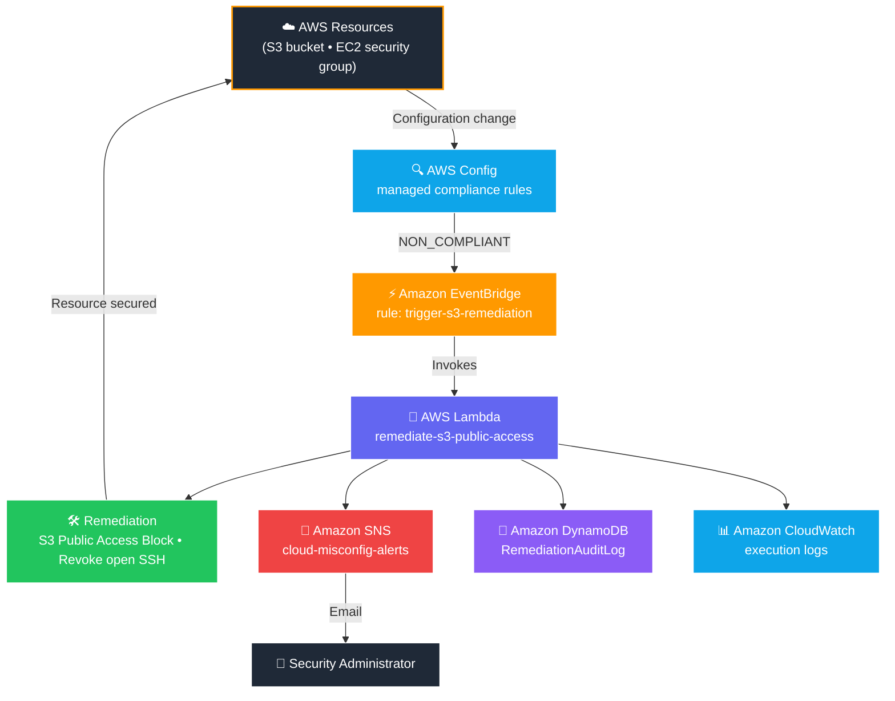
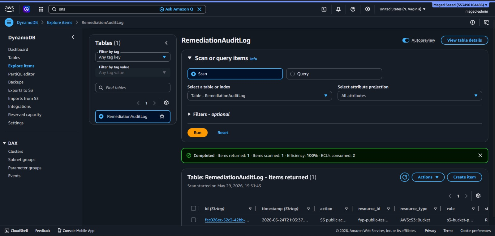

<div align="center">

<h1>☁️ AWS Cloud Misconfiguration Auto-Remediation</h1>

<p><b>Serverless, event-driven security automation on AWS.</b><br/>
Detects cloud misconfigurations, automatically remediates public S3 exposure and open SSH access,<br/>alerts administrators, and maintains a complete audit trail — built and tested in a live AWS environment.</p>

<br/>

[](https://aws.amazon.com/)
[](https://www.python.org/)
[](https://aws.amazon.com/lambda/)
[](LICENSE)

<sub>

[Overview](#-overview) • [Controls](#-implemented-controls) • [Architecture](#-architecture) • [How It Works](#-how-it-works) • [Screenshots](#-screenshots) • [Results](#-results) • [Deployment](#-deployment) • [Roadmap](#-future-work)

</sub>

</div>

<br/>

<div align="center">

<table>
<tr>
<td align="center"><b>🎓 Project</b><br/><sub>Final Year Project</sub></td>
<td align="center"><b>🌍 Region</b><br/><sub>us-east-1</sub></td>
<td align="center"><b>🐍 Runtime</b><br/><sub>Python 3.12</sub></td>
<td align="center"><b>⚡ Model</b><br/><sub>Event-driven</sub></td>
<td align="center"><b>✅ Status</b><br/><sub>Working &amp; tested</sub></td>
</tr>
</table>

</div>

---

## 🌐 Overview

Cloud misconfigurations — such as a publicly readable S3 bucket or an open SSH port — are among the most common causes of security incidents, and fixing them manually is slow and does not scale.

This project implements a serverless, event-driven remediation pipeline on AWS. **AWS Config** continuously evaluates resources against managed compliance rules. When a resource becomes non-compliant, **Amazon EventBridge** triggers an **AWS Lambda** function that remediates the misconfiguration, records the event in **DynamoDB**, and sends an email alert through **Amazon SNS**, with full execution logging in **Amazon CloudWatch**.

The entire system was deployed and tested in a live AWS account in the `us-east-1` region.

<div align="center">

| 🔍 Detect | 🛠️ Remediate | 📣 Alert | 🧾 Audit |
|:---:|:---:|:---:|:---:|
| AWS Config rules | Lambda function | SNS email | DynamoDB + CloudWatch |

</div>

---

## 🚨 Problem Statement

A single exposed resource can compromise an entire cloud environment, and the real risk lives in the gap between a misconfiguration appearing and it being detected and fixed. Manual monitoring is slow, easy to miss across many resources, and reactive — problems are often found *after* an incident rather than before one. This project closes that gap automatically for the controls it covers, responding within seconds of a violation.

---

## ✅ Implemented Controls

<div align="center">

| Control | AWS Config Rule | Action |
|:---|:---|:---:|
| **S3 Public Read** | `s3-bucket-public-read-prohibited` | 🛠️ &nbsp;Detect + Auto-Remediate |
| **S3 Public Write** | `s3-bucket-public-write-prohibited` | 🛠️ &nbsp;Detect + Auto-Remediate |
| **SSH Exposure (EC2)** | `restricted-ssh` | 🛠️ &nbsp;Detect + Remediate |
| **IAM User MFA** | `iam-user-mfa-enabled` | 🔔 &nbsp;Detect + Alert |
| **Root Account MFA** | `root-account-mfa-enabled` | 🔔 &nbsp;Detect + Alert |

</div>

**Supporting capabilities**

- 📣 &nbsp;Email alerting through Amazon SNS
- 🧾 &nbsp;Audit logging in Amazon DynamoDB
- 📊 &nbsp;Execution monitoring in Amazon CloudWatch

> MFA findings are **alert-only** because enabling MFA requires manual user enrollment (registering a device) and cannot be remediated programmatically. The system records the finding and notifies the administrator instead of acting on it.

---

## 🏗️ Architecture

The system is event-driven and fully serverless — no servers to manage, and every component scales and bills on demand.



---

## 🧰 AWS Services Used

<div align="center">


</div>

| Service | Role in the Project |
|:---|:---|
| **AWS Config** | Continuously evaluates resources against the managed compliance rules |
| **Amazon EventBridge** | Routes `NON_COMPLIANT` compliance events to Lambda |
| **AWS Lambda** | Executes the remediation logic and triggers alerting and logging |
| **Amazon S3** | Monitored and auto-remediated target resource |
| **Amazon EC2** | Monitored for open SSH ingress via `restricted-ssh` |
| **Amazon SNS** | Sends email alerts via the `cloud-misconfig-alerts` topic |
| **Amazon DynamoDB** | Stores the audit trail in the `RemediationAuditLog` table |
| **Amazon CloudWatch** | Captures Lambda execution logs |
| **AWS IAM** | Provides the Lambda execution role and permissions |

---

## ⚙️ How It Works

```text
 1.  AWS Config evaluates a resource and marks it NON_COMPLIANT
 2.  EventBridge matches the "Config Rules Compliance Change" event
 3.  EventBridge invokes the Lambda function (remediate-s3-public-access)
 4.  Lambda reads the configRuleName, resourceId, and resourceType from the event
 5.  Lambda applies the matching remediation:
        • S3  → enable the S3 Public Access Block and remove the bucket policy
        • SSH → revoke inbound 0.0.0.0/0 ingress on port 22
        • MFA → record an alert-only finding
 6.  The outcome is written to the RemediationAuditLog DynamoDB table
 7.  An email alert is published to the cloud-misconfig-alerts SNS topic
 8.  CloudWatch records the full execution log
```

<details>
<summary><b>EventBridge event pattern (as deployed)</b></summary>

<br/>

```json
{
  "source": ["aws.config"],
  "detail-type": ["Config Rules Compliance Change"],
  "detail": {
    "configRuleName": [
      "s3-bucket-public-read-prohibited",
      "s3-bucket-public-write-prohibited",
      "restricted-ssh",
      "iam-user-mfa-enabled",
      "root-account-mfa-enabled"
    ],
    "newEvaluationResult": {
      "complianceType": ["NON_COMPLIANT"]
    }
  }
}
```

</details>

---

## 🔧 Configuration & IAM

**Lambda environment variables**

| Key | Value |
|:---|:---|
| `DYNAMODB_TABLE` | `RemediationAuditLog` |
| `SNS_TOPIC_ARN` | `arn:aws:sns:us-east-1:************:cloud-misconfig-alerts` |

**Lambda execution role — attached policies**

```text
AmazonS3FullAccess
AmazonEC2FullAccess
AmazonRDSFullAccess
AmazonDynamoDBFullAccess
AmazonSNSFullAccess
IAMFullAccess
AWSLambdaBasicExecutionRole-... (customer managed)
```

These are AWS managed full-access policies covering the services the function interacts with. Scoping them down to least-privilege permissions is part of planned future work.

---

## 📸 Screenshots

<div align="center">

<table>
<tr>
<td width="50%" align="center">
<br/>
<sub><b>AWS Config Rules</b><br/>Managed rules and compliance status</sub>
</td>
<td width="50%" align="center">
<br/>
<sub><b>EventBridge Rule</b><br/>trigger-s3-remediation on NON_COMPLIANT</sub>
</td>
</tr>
<tr>
<td width="50%" align="center">
<br/>
<sub><b>Lambda Function</b><br/>remediate-s3-public-access (Python 3.12)</sub>
</td>
<td width="50%" align="center">
<br/>
<sub><b>IAM Permissions</b><br/>Execution role and attached policies</sub>
</td>
</tr>
<tr>
<td width="50%" align="center">
<br/>
<sub><b>DynamoDB Audit Log</b><br/>RemediationAuditLog records</sub>
</td>
<td width="50%" align="center">
<br/>
<sub><b>CloudWatch Logs</b><br/>Lambda execution logs</sub>
</td>
</tr>
<tr>
<td colspan="2" align="center">
<br/>
<sub><b>SNS Email Alert</b><br/>Notification delivered after remediation</sub>
</td>
</tr>
</table>

</div>

---

## 🧪 Results

The pipeline was validated by intentionally creating a publicly accessible S3 bucket (`fyp-public-test-123`) and observing the automated response.

Each remediation event produced an AWS Config evaluation marked `NON_COMPLIANT`, an EventBridge trigger, a Lambda execution of roughly one second, an SNS email notification, a DynamoDB audit record, and a CloudWatch execution log.

<details open>
<summary><b>Sample DynamoDB audit record</b></summary>

<br/>

```json
{
  "id": "fec026ec-52c3-42bb-...",
  "timestamp": "2026-05-24T21:03:37Z",
  "rule": "s3-bucket-public-read-prohibited",
  "resource_id": "fyp-public-test-123",
  "resource_type": "AWS::S3::Bucket",
  "action": "S3 public access blocked + policy deleted",
  "status": "REMEDIATED"
}
```

</details>

<div align="center">

### ✅ &nbsp; Status: REMEDIATED SUCCESSFULLY

</div>

After remediation, the S3 Config rules return to `Compliant`, confirming that public access was blocked automatically without administrator intervention.

---

## 📁 Repository Structure

```text
AWS-Cloud-Misconfiguration-Auto-Remediation/
│
├── lambda/
│   └── auto-remediation.py        # Remediation function
│
├── screenshots/                   # Implementation evidence
│   ├── aws-config-rules.png
│   ├── eventbridge-rule.png
│   ├── lambda-function.png
│   ├── iam-permissions.png
│   ├── dynamodb-audit-log.png
│   ├── cloudwatch-logs.png
│   └── sns-alert-email.png
│
├── README.md
├── LICENSE
└── .gitignore
```

---

## 🚀 Deployment

All resources were provisioned through the AWS Management Console in the `us-east-1` (N. Virginia) region for demonstration purposes.

1. Enable AWS Config and add the managed rules.
2. Create the SNS topic `cloud-misconfig-alerts` and subscribe an email endpoint.
3. Create the DynamoDB table `RemediationAuditLog` with partition key `id`.
4. Create the Lambda function `remediate-s3-public-access` (Python 3.12) and set its environment variables.
5. Attach the IAM execution role with the required service permissions.
6. Create the EventBridge rule `trigger-s3-remediation` to invoke Lambda on `NON_COMPLIANT` compliance-change events.
7. Test the pipeline with a deliberately public S3 bucket and verify remediation, alerting, logging, and auditing.

---

## ⚠️ Limitations

- The fully verified end-to-end remediation is the S3 public access control; SSH remediation is implemented and triggered by the same pipeline.
- MFA controls are alert-only, since enabling MFA requires manual user enrollment.
- The Lambda role uses broad AWS managed policies rather than least-privilege policies.
- Deployment is performed manually through the AWS Console rather than Infrastructure-as-Code.
- The system runs in a single account and single region (`us-east-1`).

---

## 🗺️ Future Work

- Implement strict least-privilege IAM policies for the Lambda role.
- Activate RDP and RDS public-access remediation (handlers are already implemented in the Lambda and require the corresponding AWS Config rules to be enabled).
- Improve error handling so the recorded status always reflects the true result of each remediation.
- Package the stack as Infrastructure-as-Code using Terraform or AWS SAM.
- Add multi-account support through AWS Organizations.
- Integrate AWS CloudTrail for deeper forensic context.
- Build a security dashboard and automated compliance reports.

---

## 📜 License

This project is licensed under the **MIT License** — see the [LICENSE](LICENSE) file for details.

---

<div align="center">

### 👤 Author

**Maged Saeed**

<sub>Final Year Project (FYP) — Cloud Security Automation Using AWS Native Services</sub>

</div>
