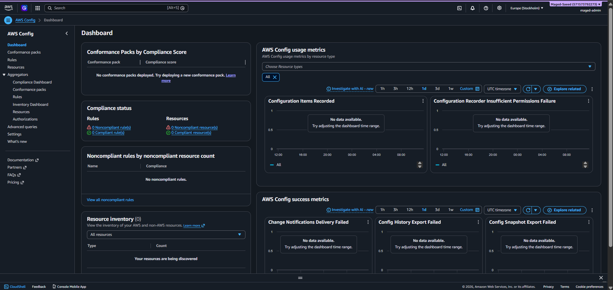

# Cloud Misconfiguration Detection and Auto-Remediation System for AWS

## Phase 1 — AWS Config Setup ✅
- Enabled AWS Config in us-east-1 region
- Created S3 logging bucket
- Enabled continuous configuration recording
- Added 5 managed rules:
  - `s3-bucket-public-read-prohibited`
  - `s3-bucket-public-write-prohibited`
  - `restricted-ssh`
  - `iam-user-mfa-enabled`
  - `root-account-mfa-enabled`

## Phase 2 — Amazon EventBridge ✅
- Created EventBridge rule to capture Config compliance change events
- Filtered to trigger only on `NON_COMPLIANT` events
- Connected target to Lambda function

## Phase 3 — AWS Lambda Remediation Function ✅
- Created function `remediate-s3-public-access` (Python 3.12)
- Handles 5 misconfiguration types: S3, SSH, RDP, RDS, IAM MFA
- Attached required IAM permissions (S3, EC2, RDS, IAM, DynamoDB, SNS)

## Phase 4 — Amazon SNS Notifications ✅
- Created topic `cloud-misconfig-alerts`
- Subscribed admin email
- Email alert sent on every remediation

## Phase 5 — DynamoDB Audit Logging ✅
- Created table `RemediationAuditLog`
- Logs every remediation with: rule, resource, action, status, timestamp

## Phase 6 — Testing ✅
- Created test S3 bucket `fyp-public-test-123`
- Made it public intentionally
- System detected, remediated, logged, and sent email automatically

## Screenshots

## AWS Config Rules

